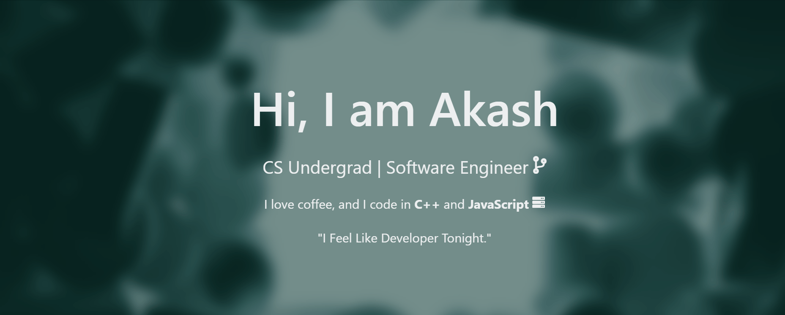

<!--
 Hello, wassupp :) 
-->

- 🔭 Currently engineering at **[Dell Technologies](https://dell.com/)** in the Payments and Settlements Team.
- 🕮 Always curious about server-side technologies and system design.
- 🍘 Always up for collaboration on projects or research work.
 
  

<h3> <strong>Connect With Me Here :)</strong></h3>
<code>  
  
  </code>
 

<strong>Tools</strong>

<code></code>
<code></code>
<code></code><code></code>
<code></code><code></code>
<code></code>
<code></code>
 

<strong>Language & Frameworks</strong>

 
<code></code>
<code></code>
<code></code>
<code></code>
<code></code>
<code></code>
<code></code>
<code></code>
<code>  </code>
<code></code>
<code></code>
<code></code>
<code></code>
 

 

<strong>View Developer Community Engagements</strong>

    <ul><li>President \ Community Lead at <strong>Mozilla BBSR</strong>.</li>
    <li>Technical Executive at <strong>Microsoft Student Community</strong>.</li>
    <li>Former Web Development Lead at <strong>GeeksForGeeks KIIT</strong>.</li>
    <li>Former Project Mentor at <strong>GWOC 2021</strong>.</li>
    <li>Former Student Mentor at <strong>LGM Summer Of Code 2021</strong>.</li>
    </ul>

<!-- :P -->
---
## **Github Statistics**

<!-- 

  

 -->
<code>

 

---
## **Pinned Repository**

---